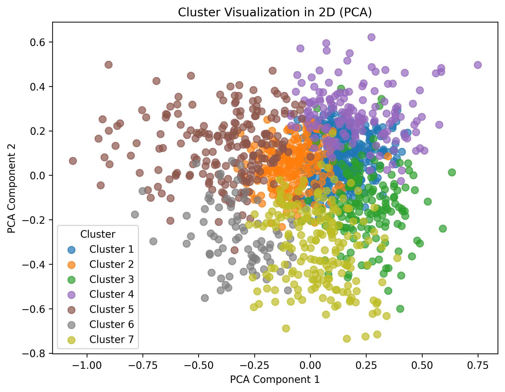
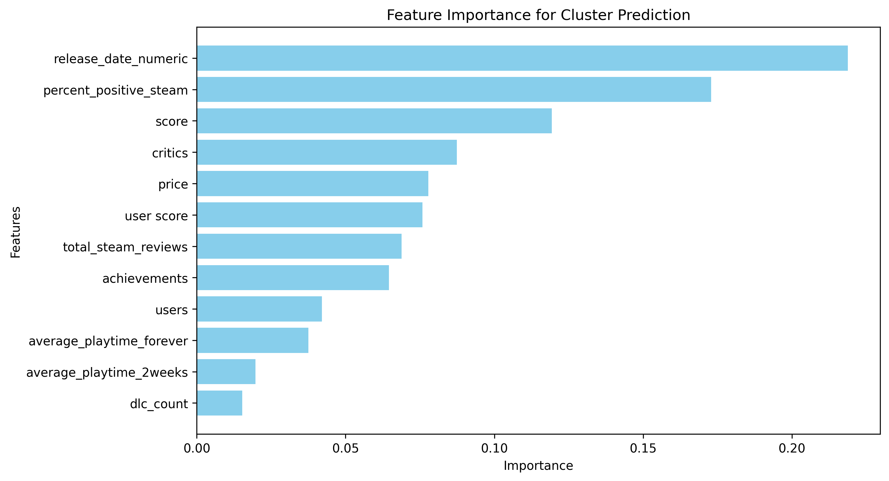

<h1>Unsupervised Learning on PC Video Game Market Data</h1>

The purpose of this project is to use various unsupervised learning methods to categorise PC Games based on multi-dimensional data without pre-defined labels. This allows for the discovery of hidden relationships within gaming data.

Data was sourced from Steam, the largest PC gaming storefront and Metacritic, the foremost video game review aggregation site combining market metrics (Price, Sales) with reviewer feedback (user and critic scores).

The analysis successfully identified distinct clusters of games, key features for the categorisation and classified the characteristics of each cluster in terms of the features (see below). These clusters can be used in game recommendation systems for a better user experience.

<h3>Cluster Visualisation using Principal Component Analysis</h3>

 
<h3>Feature Importance for Clustering</h3>

 
